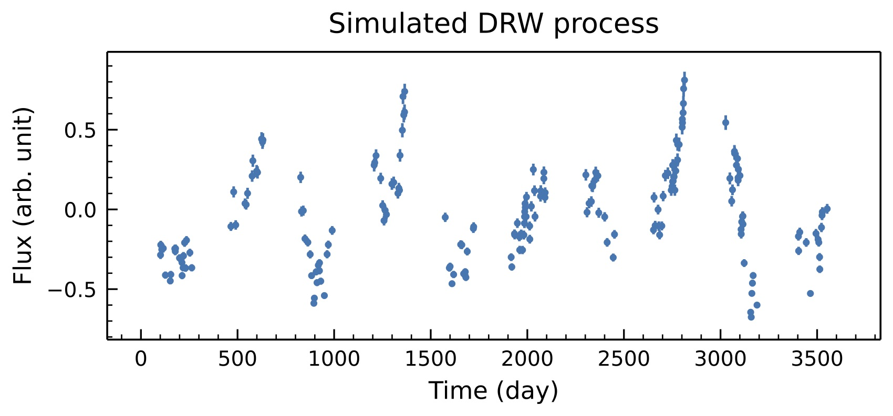
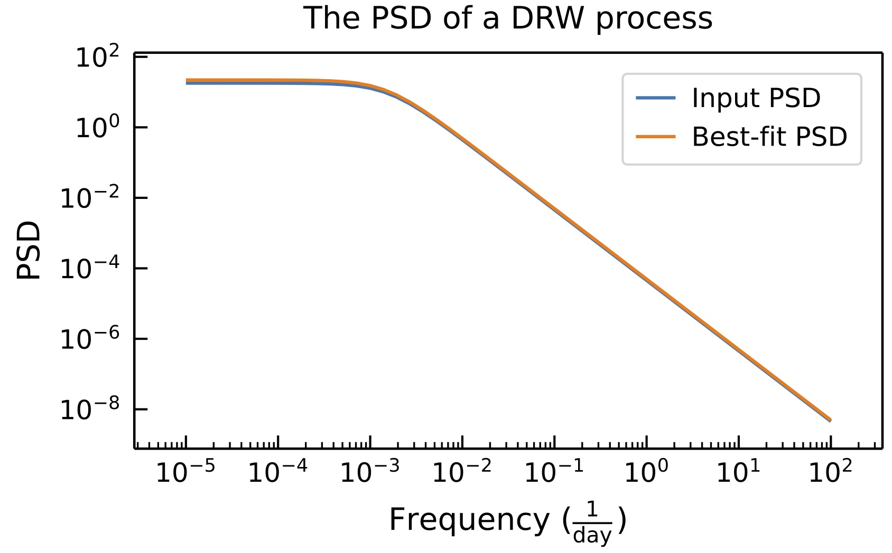

# EzTao (易道)
**EzTao** is a toolkit for conducting AGN time-series/variability analysis, mainly utilizing the continuous-time auto-regressive moving average model (CARMA)

## Installation
```
pip install eztao
```
### Dependencies
>```
>python = "^3.7"
>numpy = "^1.19.1"
>celerite = "^0.4.0"
>matplotlib = "^3.3.1"
>scipy = "^1.5.2"
>numba = "^0.51.2"
>```

### Quick Examples
Let's first simulate a DRW/CARMA(1,0) process with a variance of 0.3^2 and a relaxation timescale of 100 days. This time series will have a total of 200 data points and span 10 years.
```python
import numpy as np
import matplotlib.pyplot as plt
from eztao.carma import DRW_term
from eztao.ts import gpSimRand

# define kernel
amp = 0.3
tau = 100
DRW_kernel = DRW_term(np.log(amp), np.log(tau))
t, y, yerr = gpSimRand(DRW_kernel, 10, 365*10, 200)

# now, plot it
fig, ax = plt.subplots(1,1, dpi=150, figsize=(8,3))
ax.errorbar(t, y, yerr, fmt='.')
...
```


We can fit the simulated time series to the DRW model and see how well we can recover the input parameters.
```python
from eztao.ts import drw_fit

best_fit = drw_fit(t, y, yerr)
print(f'Best-fit DRW parameters: {best_fit}')
```
```shell
Best-fit DRW parameters: [0.32236277 106.37368799]
```

How does the power spectrum density (PSD) compare?
```python
from eztao.carma import gp_psd

# get psd functions
true_psd = gp_psd(DRW_kernel)
best_psd = gp_psd(DRW_term(*np.log(best_fit)))

# plot
fig, ax = plt.subplots(1,1, dpi=150, figsize=(6,3))
freq = np.logspace(-5, 2)
ax.plot(freq, true_psd(freq), label='Input PSD')
ax.plot(freq, best_psd(freq), label='Best-fit PSD')
...
```


__Note:__ How well the input and best-fit PSD match is up to how good the best-fit parameters are, which is highly influenced by the quality of the input time series. 

For more examples, please check out the tutorial folder. 

### Development
`poetry` is used to solve dependencies and to build/publish this package. Below shows how setup the environment for development (assuming you already have `poetry` installed on your machine). 

1. Clone this repository, and enter the repository folder.
2. Create a python virtual environment and activate it. 
    ```
    python -m venv env
    source env/bin/activate
    ```
3. Install dependencies and **EzTao** in editable mode.
   ```
   poetry install
   ```

Now you should be ready to start adding new features. Be sure to checkout the normal practice regarding how to use `poetry` on its website. When you are ready to push, also make sure the poetry.lock file is checked-in if any dependency has changed. 
