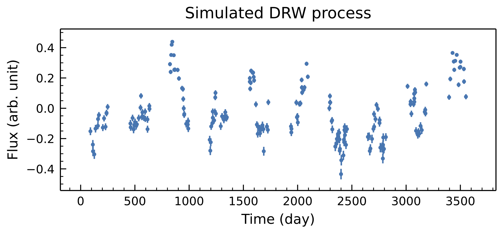
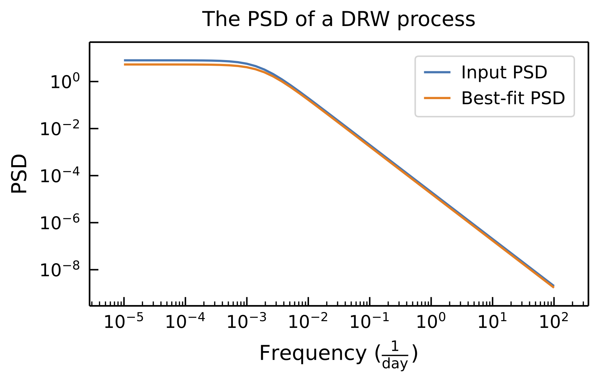

[](https://mybinder.org/v2/gh/ywx649999311/EzTao/v0.4.3?filepath=docs/notebooks)
[](https://eztao.readthedocs.io/en/latest/)
<a href="https://ascl.net/2201.001"></a>
# EzTao (易道)
**EzTao** is a toolkit for conducting AGN time-series/variability analysis, mainly utilizing the continuous-time auto-regressive moving average model (CARMA)

## Installation
<!--- ```
pip install eztao
```
or (from master)--->
```
pip install git+https://github.com/ywx649999311/EzTao.git
```
### Dependencies
>```
>python = ">=3.8,<3.12"
>celerite = ">= 0.3.0"
>scipy = "> 1.5.0"
>numba = ">= 0.57.0"
>matplotlib = ">=3.3.3"
>emcee = ">=0.3.0"
>```

## Quick Examples
Let's first simulate a DRW/CARMA(1,0) process with a variance of 0.3^2 and a relaxation timescale of 100 days. This time series will have a total of 200 data points and span 10 years.
```python
import numpy as np
import matplotlib.pyplot as plt
from eztao.carma import DRW_term
from eztao.ts import gpSimRand

# define a DRW kernel & and simulate a process
amp = 0.2
tau = 100
DRW_kernel = DRW_term(np.log(amp), np.log(tau))
t, y, yerr = gpSimRand(DRW_kernel, 10, 365*10, 200)

# now, plot it
fig, ax = plt.subplots(1,1, dpi=150, figsize=(8,3))
ax.errorbar(t, y, yerr, fmt='.')
...
```


We can fit the simulated time series to the DRW model and see how well we can recover the input parameters.
```python
from eztao.ts import drw_fit

best_fit = drw_fit(t, y, yerr)
print(f'Best-fit DRW parameters: {best_fit}')
```
```shell
Best-fit DRW parameters: [0.17356983 88.36262467]
```

How does the power spectrum density (PSD) compare?
```python
from eztao.carma import gp_psd

# get psd functions
true_psd = gp_psd(DRW_kernel)
best_psd = gp_psd(DRW_term(*np.log(best_fit)))

# plot
fig, ax = plt.subplots(1,1, dpi=150, figsize=(6,3))
freq = np.logspace(-5, 2)
ax.plot(freq, true_psd(freq), label='Input PSD')
ax.plot(freq, best_psd(freq), label='Best-fit PSD')
...
```


__Note:__ How well the input and best-fit PSD match is up to how good the best-fit parameters are, which is highly influenced by the quality of the input time series.

For more examples, please check out the [online documentation](https://eztao.readthedocs.io/en/latest/) or run the tutorial notebooks at ->
[](https://mybinder.org/v2/gh/ywx649999311/EzTao/v0.4.0?filepath=docs/notebooks).

## Development
`poetry` is used to solve dependencies and to build/publish this package. Below shows how setup the environment for development (assuming you already have `poetry` installed on your machine). _**Warning:**_ `poetry` is having issue installing `llvmlite = 0.34.0` (used for `eztao = ^0.4.0`) under Python 3.9. The issue disappears for Python 3.8.

1. Clone this repository, and enter the repository folder.
2. Create a python virtual environment and activate it (the virtual environment name must be '.venv').
    ```
    python -m venv .venv
    source .venv/bin/activate
    ```
3. Install dependencies and **EzTao** in editable mode.
   ```
   poetry install
   ```

Now you should be ready to start adding new features. Be sure to checkout the normal practice regarding how to use `poetry` on its website. When you are ready to push, also make sure the poetry.lock file is checked-in if any dependency has changed.

## Citation
We are working on a paper to describe the full implementation of **EzTao**. In the meantime, if you find **EzTao** useful for your research, please consider acknowledging **EzTao** using the following:

```
@MISC{Yu2022,
       author = {{Yu}, Weixiang and {Richards}, Gordon T.},
        title = "{EzTao: Easier CARMA Modeling}",
     keywords = {Software},
 howpublished = {Astrophysics Source Code Library, record ascl:2201.001},
         year = 2022,
        month = jan,
          eid = {ascl:2201.001},
        pages = {ascl:2201.001},
archivePrefix = {ascl},
       eprint = {2201.001},
       adsurl = {https://ui.adsabs.harvard.edu/abs/2022ascl.soft01001Y},
      adsnote = {Provided by the SAO/NASA Astrophysics Data System}
}
```
